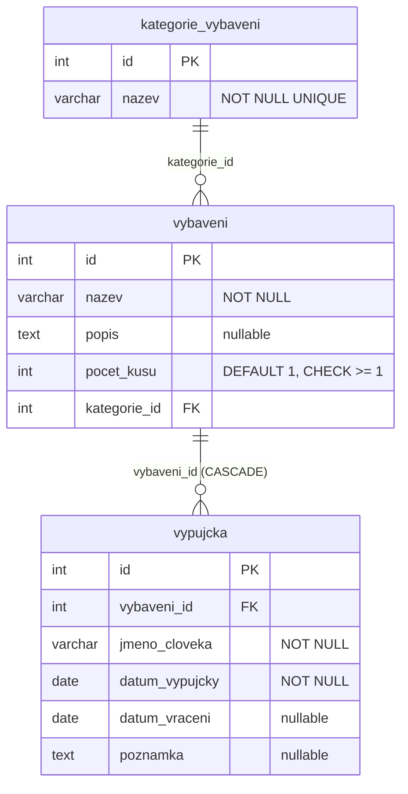

# Správa oddílového vybavení

Desktopová aplikace v **Avalonia (.NET 8, MVVM)** pro správu vybavení skauts­kého oddílu. Umožňuje evidovat předměty vybavení a záznamy o jejich výpůjčkách.

## ER diagram



- **kategorie_vybaveni** – číselník kategorií (stan, lano, …)
- **vybaveni** – hlavní entita (název, počet kusů, kategorie)
- **vypujcka** – dětská entita 1:N (komu, kdy půjčeno / vráceno)

## Požadavky

- [.NET 8 SDK](https://dotnet.microsoft.com/download)
- [Docker Desktop](https://www.docker.com/products/docker-desktop/)

## Spuštění

### 1. Naklonuj repozitář a připrav prostředí

```bash
git clone <url-repozitare>
cd OddiloveVybaveni
cp .env.example .env
# Případně uprav hodnoty v .env
```

### 2. Spusť databázi

```bash
docker compose up -d
```

Databáze se automaticky inicializuje schématem (`schema.sql`) a naplní číselníkem (`seed.sql`).

### 3. Spusť aplikaci

```bash
dotnet run
```

## Struktura projektu

```
OddiloveVybaveni/
├── Models/            – datové třídy (Vybaveni, Vypujcka, KategorieVybaveni)
├── Repositories/      – interface + implementace (přístup k DB přes Npgsql)
├── Services/          – IDialogService + DialogService
├── ViewModels/        – MVVM ViewModels s CommunityToolkit.Mvvm
├── Views/             – Avalonia AXAML views + windows
├── AppServices.cs     – registrace DI kontejneru
├── docker-compose.yaml
├── schema.sql
├── seed.sql
└── .env.example
```
